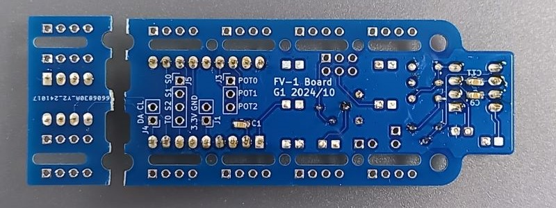

# FV-1 Reverb Effects Developer Kit
 [Spin Semiconductor FV-1](https://spinsemi.com/products.html)を用いたエフェクタの製作例 
 ・BOXタイプ 
  

 ・バーコーダー内蔵タイプ 
  

## 参考サイト
| リンク |備考 |
|:---|:---|
|[REVERBS/EFFECTS　日本語説明書](https://home-bake-instruments.localinfo.jp/posts/37592163/)|開発方法、EEPROM書き込み|
|[Getting Started with the FV-1](https://electric-canary.com/fv1start.html)|FV-1概要　|
|[2400円で作る高品質DSPマルチエフェクター](https://note.com/solder_state/n/n1c402a78a0fe) |Arduinoからプログラム変更、POT設定　|
|[FV-1を使った自作エフェクタ](http://studio-do.org/mini-effector/mini_effector_web01.html)|ロータリースイッチ、インテルHEXフォーマット|
|[アコギ用空間系エフェクター　FV-1](https://ameblo.jp/gustywind/entry-12778592028.html)|　|
|[Spin Semiconductor FV-1でエフェクターを自作する](https://marksard.github.io/2023/08/14/pocketeffector/)|　|
|[ASICチップ FV-1を使ったエフェクターの自作](http://dubelectro.seesaa.net/article/399349842.html)|　|

## 部品
- BOXタイプ・バーコーダー内蔵　共通

|        | リンク | 数量 | 備考 |
|:------|:---|:---:|:---|
|FV-1 DIP化モジュールキット|[FV-1](https://akizukidenshi.com/catalog/g/g115566/)| 1 |キットの方がIC単体より安い |
|低電圧動作パワーアンプ|[NJM2113D](https://akizukidenshi.com/catalog/g/g111192/)| 1 |DryWetのMix用 |
|I2C シリアルEEPROM|[24FC64-I/P](https://akizukidenshi.com/catalog/g/g103567/)| 1 |外部エフェクト保存用|
|ICソケット|[8P](https://akizukidenshi.com/catalog/g/g100017/)| 1 |EEPROM書込時クリップ使用なら不要 |
|基板取付用2連ボリューム|[B10kΩ](https://akizukidenshi.com/catalog/g/g112576/)| 4 |MIX用に2連、その他は１連でも可 |
|DIPロータリースイッチ|[16ポジション 0~F 負論理](https://akizukidenshi.com/catalog/g/g102277/)| 1 |負論理だと番号合わせやすい |
|半固定ボリューム|[GF063P 20kΩ](https://akizukidenshi.com/catalog/g/g114906/)| 2 |入力・出力ゲイン調整用 |
|小型 金属皮膜抵抗|[1/4W10kΩ](https://akizukidenshi.com/catalog/g/g108550/)| 4 | |
|チップ積層セラミックコンデンサー|[0.1μF50V](https://akizukidenshi.com/catalog/g/g111384/)| 3 | |
|片面丸型ユニバーサル基板|[20mm](https://akizukidenshi.com/catalog/g/g108753/)  | 1 | |
|ポテンショメータコントロールノブ|[D形](https://www.amazon.co.jp/dp/B084JC6CRS)| 3 |好みで 必ずD型を|
|ポテンショメータコントロールノブ|[D形](https://www.amazon.co.jp/dp/B0CW5WQ7RC) | 1 |好みで 必ずD型を|
|プラスチックスペーサー|[3-5](https://akizukidenshi.com/catalog/g/g115212/)| 2 | |
|5mmLED用ワンタッチブラケット|[LED5-16S](https://akizukidenshi.com/catalog/g/g111465/)| 1 | |
|抵抗内蔵5mmLED|[赤色 640nm](https://akizukidenshi.com/catalog/g/g106245/)| 1 | |
|超低頭小ねじ|M3×12mm| 2 |　|
|ナット|M3| 2 |　|
|EEPROMライター|[CH341A ROMライター](https://www.amazon.co.jp/dp/B07LGNTJ29)|  |クリップ付きなどもあり、Arduinoで書き込みも可|
 
- BOXタイプ用

|        | リンク | 数量 | 備考 |
|:------|:---|:---:|:---|
|プラスチックケース|[SW-100B](https://www.amazon.co.jp/dp/B07BD5JGDB)| 1 | |
|3.5mmステレオミニジャック|[MJ-355W](https://akizukidenshi.com/catalog/g/g113305/)  | 2 | |
|オーディオ用電解コンデンサー|[1μF50V85℃ ニチコンFG](https://akizukidenshi.com/catalog/g/g104620/)| 8 | |
|3.3Vレギュレータモジュール|[AMS1117-3.3](https://www.amazon.co.jp/dp/B086WWGVCL)| 1 | |
|ボリューム配線用基板|[2連](https://www.findtec.jp/c-item-detail?ic=1001282)| 4 |なくても可|
|プラスチックスペーサー|[3-5](https://akizukidenshi.com/catalog/g/g115212/)| 4 | |
|さら小ねじ|M3×15mm| 4 | |
|ナット|M3| 2 |　|
 
- バーコーダー内蔵用

|        | リンク | 数量 | 備考 |
|:------|:---|:---:|:---|
|バーコードリーダー|[BEVA](https://www.amazon.co.jp/dp/B077GRDQGP?th=1)| 1 | |
|チップ積層セラミックコンデンサー|[1μF50V X7R](https://akizukidenshi.com/catalog/g/g113699/)| 8 | |
|バーコーダー用アンプ基板|[HowToMakeBarcoder](https://github.com/hide63414/HowToMakeBarcoder)|1 | |
 

## 回路図
VR1:入力レベル設定 FV-1のピークインジケータ点灯しないレベルにする 
VR2:DRY-WETの割合設定 
VR3:出力レベル設定 

回路図

## BOX内蔵タイプ作製例
完成品 
 

組み立て手順

1. FV-1用基板 
上:部品面 
下:半田面（C1,C9,C11の面実装コンデンサはこちらの面に実装） 
 

1. 部品実装 
電解コンデンサは極性に注意 
 
3.3V供給するためレギュレータを周囲のパッドを利用して取り付ける 
 

1. 部品と配線接続 
電源、可変抵抗、ロータリースイッチ、ステレオミニジャックを基板に接続する 
 
J1:レギュレータのGNDと3.3V出力の接続 
 
J2,J6:IN,OUTのステレオミニジャックとの接続 □がGND 
 
J3:可変抵抗(POT0-2)との接続　それぞれ3.3VとGNDもつなぐ 
 
　それぞれ3.3VとGNDもつなぐ 
 
J5:ロータリースイッチとの接続 
 
　φ20mmユニバーサル基板にロータリースイッチを実装する 
 
　φ20mmユニバーサル基板との接続　T0:8 S2:4 S1:2 S0:1 GND:C 
 
VR2:可変抵抗の接続 
 
　可変抵抗と配線の接続(基板接続と同じ並びにする) 
 

1. ケース加工 
可変抵抗、ロータリースイッチ用の穴をあける 
 ※固定用の穴とロータリースイッチの中心にずれあり 
 
 可変抵抗の回転止めの穴(貫通してもよい) 
 
 基板固定用穴(皿もみ加工する) 
 
 穴情報(60x23 φ3.2) 
 

1. 基板と部品をケースに固定する 
 ケースとロータリスイッチ用基板はスペーサを使って浮かせる
 
 
 完成（電源表示LED追加） 
 

## Barcoder内蔵タイプ作製例
完成品 
 

組み立て手順

1. Barcoderを制作しておく 
基本的にはBEVAを使用すること 
[HowToMakeBarcoder](https://github.com/hide63414/HowToMakeBarcoder) 

1. FV-1用基板分割と部品実装 
EEPROM部分で基板を分割　C1,C9,C11の面実装コンデンサを実装 
 
各種部品を実装　EEPROMはソケット使用　コンデンサは面実装品 
 

1. ケース加工 
可変抵抗、ロータリースイッチ用の穴をあける 
※固定用の穴とロータリースイッチの中心にずれあり 
 
 
可変抵抗、ロータリースイッチ取り付け 
 
 

1. 配線接続 
各基板間の配線を接続する 
　※電源は3.3Vに接続すること 
　3.3V電源はバーコーダー基板にあり 下図3.3V表示部 
 
ロータリースイッチと可変抵抗
 
EEPROM 3.3V(赤),GND(黒),SCK(黄),SDA(橙) 
 
FV-1基板(FV-1 OUT→Audio出力L白 写真と反対面に接続したほうが組み立てやすい） 
 
基板間接続 
　配線長さは次節の組み立てを参考に組み立てやすい長さにする 
　可変抵抗と基板の接続先の詳細はBOXタイプ参照 
 
 
FV-1基板とBarcoderアンプ基板 
　Barcoderアンプ基板のOUT1→FV-1基板IN 
　FV-1基板OUT→Audioケーブル L(白) 
 

1. 基板固定 
バーコーダーのグリップ内の溝にFV-1基板を入れる 
 
 
Barcoderアンプ基板をねじ止め 
 
 

1. 組み立て 
配線を挟まないようにカバーを重ねる 
 
 

1. 組み立て完成 
窓部品を取り付けて完成 
 

## 外部エフェクト追加
作成中 

## TOOL
[SpinAsm software](https://www.spinsemi.com/products.html)　開発プログラム 
[FV-1 Programs](https://mstratman.github.io/fv1-programs/)　エフェクタプログラム 
[Free DSP Programs](http://www.spinsemi.com/programs.php)　エフェクタプログラム 
[UsbAsp-flash](https://github.com/nofeletru/UsbAsp-flash/releases)　EEPROM書き込みプログラム 
[CH341A ROMライター](https://www.amazon.co.jp/dp/B07LGNTJ29)　EEPROM書き込み器 

